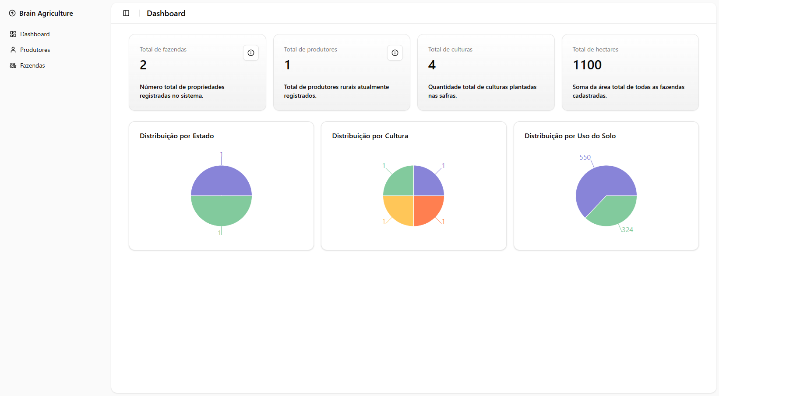

# 🌾 Dashboard de Gestão Rural

## 📄 Descrição

O Dashboard de Gestão Rural é uma aplicação web desenvolvida com **Next.js**, **React**, **TypeScript**, **Tailwind CSS** e **shadcn/ui**, projetada para facilitar a visualização e o gerenciamento de dados rurais. Ele oferece uma interface interativa e responsiva, onde é possível acompanhar todas as fazendas, todos os produtos, safras e gráficos dinâmicos de distribuição de Estado, distribuição por Cultura e distribuição por Uso do Solo.

O sistema é projetado para ser ágil, escalável e fácil de usar, com funcionalidades de gráficos interativos, e uma experiência de usuário moderna.

## 🚀 Acesse o Projeto

Você pode acessar o projeto em produção através do link abaixo:

🔗 [Dashboard de Gestão Rural]()

## 📸 Screenshot



## ❌ Por que não usamos styled-components?

Apesar de styled-components ter sido uma ferramenta muito popular para estilização em aplicações React, optamos por não utilizá-lo neste projeto por alguns motivos:

- ⚠️ Descontinuação na prática: Embora o pacote ainda exista, sua manutenção tem diminuído consideravelmente e o ecossistema tem migrado para abordagens mais modernas e performáticas.

- 🌀 Performance: Soluções como Tailwind CSS geram estilos em tempo de build, evitando o custo de runtime do CSS-in-JS.

- ⚡ Agilidade no desenvolvimento: Com Tailwind CSS, conseguimos aplicar estilos diretamente nos componentes de forma rápida e consistente, sem a necessidade de criar styled-components separados.

- 🎨 Padronização visual: Tailwind oferece tokens de design pré-definidos que ajudam a manter a consistência da interface sem criar manualmente cada estilo.

Por esses motivos, optamos por utilizar Tailwind CSS, aliado ao shadcn/ui, que oferece uma excelente base de componentes estilizados de forma moderna e escalável.

## ✨ Funcionalidades

### 📊 Dashboard com informações e graficos
- Seção de card
  - Total de fazendas
  - Total de produtores
  - Total de culturas 
  - Total de hectares
- Gráficos interativos com [Recharts](https://recharts.org/):
  - **Pie Chart**

### 📄 Fazendas
- Listagem de Fazendas
- Criação da Fazenda com o sheet
- Edição da Fazenda
- Exclusão da Fazenda

### 📄 Produtores
- Listagem de Produtores
- Criação de Produtores com o sheet
- Edição de Produtores
- Exclusão de Produtores

## 🧪 Tecnologias Utilizadas

- [Next.js](https://nextjs.org/)
- [React](https://reactjs.org/)
- [TypeScript](https://www.typescriptlang.org/)
- [Zod](https://zod.dev/)
- [React Hook Form](https://react-hook-form.com/)
- [shadcn/ui](https://ui.shadcn.dev/)
- [Sonner](https://sonner.emilkowal.ski/) (para notificações)
- [Tailwind CSS](https://tailwindcss.com/)
- [Recharts](https://recharts.org/)
- [Zustand](https://zustand-demo.pmnd.rs/) (para gerenciamento de filtros e sessão)
- [Jest](https://jestjs.io/) (para testes automatizados)

## Pré-requisitos

Para rodar esse projeto localmente, você precisará de:

- **Node.js**: [Versão mínima 14.x]
- **Yarn** ou **NPM**: [Gerenciador de pacotes]

## 🚀 Como rodar localmente

1. Clone o repositório:
```
git clone https://github.com/Tiago1106/brain-agriculture.git
cd brain-agriculture
```

2. Instale as dependências:
```
yarn 
ou 
npm install
```

3. Rode o Projeto: 
```
yarn dev
ou
npm run dev
```

5. Acesse: http://localhost:3000

## 📁 Estrutura de Pastas
```
├── public/                    # Arquivos públicos, como transactions.json
├── src/
│   ├── app/                   # Páginas e rotas da aplicação
│   ├── components/            # Componentes reutilizáveis da interface
│   ├── hooks/                 # Hooks customizados
│   ├── lib/                   # Configurações de bibliotecas, funções de fetch e utilitários de integração
│   ├── stores/                # Stores de estado global (Zustand, por exemplo)
│   └── types/                 # Tipagens
├── package.json               # Dependências e scripts do projeto
└── README.md                  # Documentação do projeto
```
## 📞 Contato

Para dúvidas ou informações adicionais, entre em contato com:

- Nome: Tiago Pinheiro
- Email: tiagofreitasp00@gmail.com
- GitHub: [Tiago1106](https://github.com/Tiago1106)
- Linkedin: [Tiago Pinheiro](https://www.linkedin.com/in/tiagofp00/) 
